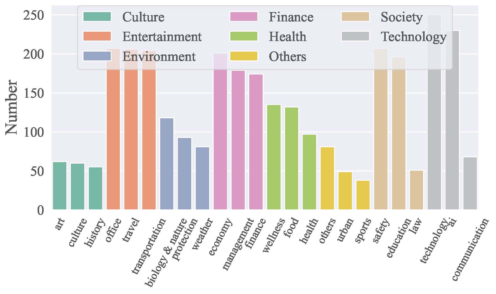
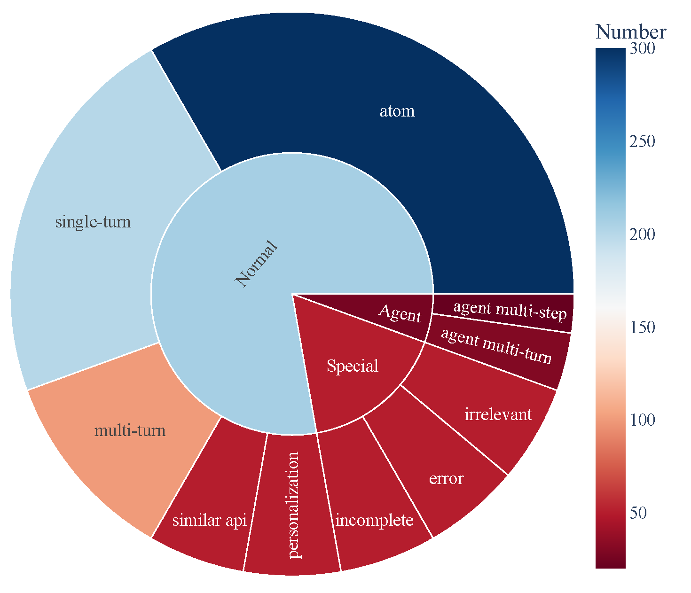

# ACEBench: 谁赢得了工具使用的赛点？

<p align="center">
  <a href="https://arxiv.org/abs/2501.12851">📃 论文 </a>
  <b>&nbsp;·&nbsp;</b> <a href="https://ACEBench.github.io/ACEBench/">🏆 榜单 (持续更新中)</a>
</p>

## 📚 内容

- [1\. 摘要](#abstract)
- [2\. 基准统计](#statistics)
- [3\. 排行榜](#leaderboard)
- [4\. 安装](#setup)
- [5\. 数据](#data)
- [6\. 推理](#inference)
  - [6.1\. 推理脚本](#open_source_inference)
  - [6.2\. 推理示例](#openai_inference)
- [7\. 评测](#evaluation)
- [引语](#citation)

---

<span id="abstract">
</span>

## 📘 1\. 摘要 [[Back to Top]](#content)

大型语言模型（LLM）在决策和推理方面已显示出巨大的潜力，特别是当与各种工具集成以有效地解决复杂问题时。然而，现有的评估LLM工具使用的基准面临几个限制：（1）有限的评估场景，通常缺乏在真实多轮对话背景下的评估；（2）评估维度狭窄，对LLM如何使用工具的详细评估不够；（3）依赖LLM或真实API执行进行评估，这引入了大量的开销。为了解决这些挑战，我们引入了ACEBench，这是一个评估LLM中工具使用情况的综合基准。ACEBench根据评估方法将数据分为三种主要类型：正常、特殊和代理。“正常”评估基本场景中的工具使用情况；“特殊”评估指令不明确或不完整情况下的工具使用情况；“代理”通过多代理交互来评估工具使用情况，以模拟真实世界的多回合对话。我们使用ACEBench进行了广泛的实验，深入分析了各种LLM，并对不同数据类型的错误原因提供了更细粒度的检查。

---

<span id="statistics">
</span>

## 📊 2.基准统计 [[Back to Top]](#content)

### **API所属领域**

- ACEBench涵盖**8大领域**和**68个子领域**，包括技术、金融、娱乐、社会、健康、文化、环境等。
- 共包含**4,538个API**，中英文均可。
- API跨域分布可视化如下图所示：

<p align="center">
  
</p>

### **数据组成**

- ACEBench由三个主要类别的测试样本组成：
  - **普通**：基本的工具使用场景。
  - **代理**：涉及用户和环境的多轮交互。
  - **特殊**：需要多个步骤或处理不可行的工具调用的复杂场景。
- 数据构成可视化如下，展示了工具使用功能的全面覆盖：

<p align="center">
  
</p>

<span id="leaderboard">
</span>

## 🏆 3\. 排行榜 [[Back to Top]](#content)

| Model                                 | normal | special | agent | overall |
| ------------------------------------- | ------ | ------- | ----- | ------- |
| gpt-4o-2024-11-20                     | 0.927  | 0.933   | 0.715 | 0.896   |
| gpt-4-turbo-2024-04-09                | 0.917  | 0.913   | 0.725 | 0.886   |
| qwen-max                              | 0.887  | 0.740   | 0.685 | 0.817   |
| o1-preview                            | 0.830  | 0.793   | 0.735 | 0.806   |
| deepseek-chat                         | 0.926  | 0.733   | 0.350 | 0.785   |
| gpt-4o-mini-2024-07-18                | 0.834  | 0.813   | 0.390 | 0.760   |
| claude-3-5-sonnet-20241022            | 0.835  | 0.820   | 0.350 | 0.756   |
| gemini-1.5-pro                        | 0.822  | 0.800   | 0.250 | 0.728   |
| o1-mini                               | 0.774  | 0.673   | 0.610 | 0.722   |
| doubao-pro-32k                        | 0.750  | 0.593   | 0.235 | 0.628   |
| Qwen2.5-Coder-32B-Instruct-local      | 0.908  | 0.813   | 0.715 | 0.853   |
| Qwen2.5-32B-Instruct-local            | 0.852  | 0.747   | 0.690 | 0.799   |
| Qwen2.5-72B-Instruct-local            | 0.873  | 0.773   | 0.525 | 0.793   |
| Qwen2.5-Coder-14B-Instruct-local      | 0.868  | 0.647   | 0.525 | 0.756   |
| Qwen2.5-14B-Instruct-local            | 0.790  | 0.540   | 0.250 | 0.640   |
| Llama-3.1-70B-Instruct-local          | 0.753  | 0.473   | 0.435 | 0.629   |
| Qwen2.5-7B-Instruct-local             | 0.759  | 0.447   | 0.125 | 0.578   |
| DeepSeek-Coder-V2-Lite-Instruct-local | 0.688  | 0.413   | 0.015 | 0.511   |
| Qwen2.5-Coder-7B-Instruct-local       | 0.735  | 0.193   | 0.125 | 0.496   |
| watt-tool-8B-local                    | 0.763  | 0.100   | 0.040 | 0.474   |
| ToolACE-8B-local                      | 0.782  | 0.013   | 0.040 | 0.462   |
| Hammer2.1-7b-local                    | 0.627  | 0.260   | 0.185 | 0.461   |
| Meta-Llama-3.1-8B-Instruct-local      | 0.450  | 0.267   | 0.040 | 0.338   |
| Qwen2.5-Coder-3B-Instruct-local       | 0.495  | 0.100   | 0.065 | 0.323   |
| Phi-3-mini-128k-instruct-local        | 0.389  | 0.253   | 0.015 | 0.295   |
| Qwen2.5-3B-Instruct-local             | 0.408  | 0.127   | 0.065 | 0.280   |
| Llama-3.2-3B-Instruct-local           | 0.327  | 0.100   | 0.000 | 0.216   |
| xLAM-7b-r-local                       | 0.187  | 0.013   | 0.075 | 0.123   |
| Hammer2.1-3b-local                    | 0.118  | 0.013   | 0.015 | 0.074   |

---

<span id="setup">
</span>

## 🛠️ 4\. 安装 [[Back to Top]](#content)

执行以下命令以安装推理和评估所需的依赖项:

```bash
pip install -r requirements.txt
```

---

## 🗂️ 5\. Data [[Back to Top]](#content)

<span id="load_data">
</span>

所有数据都存放在data_all目录下，分为英文和中文两个部分，分别位于data_en和data_zh文件夹下。每个文件夹包含多个JSON文件，命名格式为data_{category}.json，其中category代表数据类型。

```
data_all/
├── possible_answer_en/        
│   ├── data_{normal}.json
│   ├── data_{special}.json
│   ├── data_{agent}.json
├── possible_answer_zh/        
│   ├── data_{normal}.json
│   ├── data_{special}.json
│   ├── data_{agent}.json
...
```

## 🧠 6\. 推理 [[Back to Top]](#content)

<span id="open_source_inference">
</span>

### 6.1 推理脚本

要使用cmodel运行推理，请使用 `generate.py`脚本。该脚本支持各种型号、类别和语言。

### 基本用法

```bash
python generate.py  --model <model_name>  --model_path <model_path>  
--category <category> --language <language>
```

参数:

- `--model`: 指定要用于推理的模型。
- `--model_path`: 模型本地路径（仅针对开源模型）。.
- `--category`: 定义要评估的任务或数据集的类别。可以在eval_checker/eval_checker_consistent.py中找到可用的类别。
- `--language`: 指定输入/输出的语言。支持的语言：“en”（英语）、“zh”（中文）

<!-- - `--do_sample`: Enable token sampling during generation. Defaults to greedy decoding.
- `--temperature`: ecoding temperature, applicable only with `--do_sample`.
- `--top_p`: Cumulative probability threshold for token sampling, applicable only with `--do_sample`.
- `--max_new_tokens`: Maximum number of tokens to generate, default is 1024. -->

### 6.2\. 推理示例

对于闭源模型

```bash
python generate.py --model qwen-max --category test_all --language zh
```

对于本地模型

```bash
python generate.py --model Qwen2.5-3B-Instruct-local --model-path /mnt/nas/ckpt/Qwen2.5-3B-Instruct --category test_all --language zh
```

### 6.3\. 注意事项

* 运行程序前确保环境变量.env文件的配置正确，调用openai需要使用外网，请配置环境变量https_proxy和http_proxy，使用gemini模型需要用到日本代理；
* 评测的模型需要在model_inference/inference_map.py中做好映射，通过openai调用的模型可以添加到APIModelInference列表中，自定义的推理模型可以添加到CommonInference列表中，本地模型的命名以-local结尾；
* 如果需要添加自定义的评测模型，请参照model_inference/model_infer.py把模型类添加到model_dict中；
* 评测Hugging Face上的开源模型，建议使用LLaMA-Factory合并LoRA权重后推理；

## 📈 7. 评测 [[Back to Top]](#content)

要评估模型的性能，请使用 `eval_main.py`脚本。该脚本支持多种评估指标，可用于开源和闭源模型。

### 基本用法

```bash
python eval_main.py --model <model_name> --category <category> --language <language>
```

## 📄 引语

如果您觉得我们的论文和资源有用，请考虑引用我们的论文:

```bibtex
@article{chen2025acebench,
  title={ACEBench: Who Wins the Match Point in Tool Learning?},
  author={Chen, Chen and Hao, Xinlong and Liu, Weiwen and Huang, Xu and Zeng, Xingshan and Yu, Shuai and Li, Dexun and Wang, Shuai and Gan, Weinan and Huang, Yuefeng and others},
  journal={arXiv preprint arXiv:2501.12851},
  year={2025}
}
```
